## R1	Description of your website, including:
- Purpose
    
    To streamline the workflow within the working environment by providing a user-friendly platform for submitting and managing various forms. The system seeks to enhance communication and overall efficiencies involved with mid-large scale warehouse settings. 

- Functionality / features
    - Different form types and ability to create new forms. e.g. Incident report form, parts request form, receiving error forms, stock count request form, bin changes request form to name a few.
    - Every user will be able to lodge forms.
    - Different users will be granted access to be able to approve forms or read forms submitted forms. (permanent delegation)
    - Actions can be added to the forms that are assigned to a user to complete. (temporary delegation)
    - Upload functionality
    - search specific submissions
    - group search a form type
    - alter self submitted forms, cannot alter someone else's submission.

- Target audience
    - Warehouse Teams
    - HR Safety Compliance Officer

- Tech stack	GENERAL
    - MERN
        - MongoDB
        - ExpressJS
        - React
        - NodeJS

## R2	Dataflow Diagram	
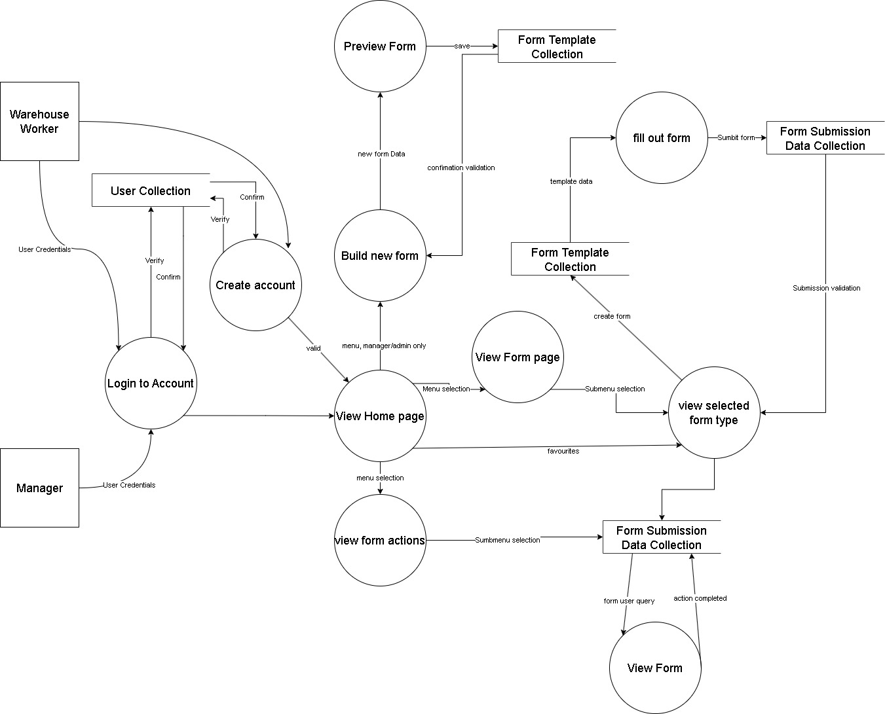

## R3	Application Architecture Diagram	

## R4	User Stories 

##### Sam (warehouse manager) Doesn't have time to deal with every issue little issue himself. Likes to use data analysis to direct decision making. Cares about the well-being of his team. Wants to streamline as much as possible to eliminate hiccups in the processes.

- As Sam, I want to be able to delegate the specific forms, so I can focus on the more important ones.
    - [ ] Assign users when building new forms
    - [ ] Re-assign forms 
- As Sam, I want to be able to extract this data for analysis, So I can find trends and adapt the warehouse processes or report to my boss how well things are going.
    - [ ] Export spreadsheet of form listings
- As Sam, I want to be able to make new form types or change the ones I have, So I can feel in control of my warehouses processes.
    - [x] Form builder
    - [ ] Add functionality to modify forms
- As Sam, I want the team to at least give me certain points of information, sometimes they don't give me enough to do anything with.
    - [ ] implement requirement flag for fields in form builder

##### Justin (warehouse manager) Tech saavy valuing efficiency. Security-concious prioritizing data protection.

- As Justin, I want the form app to have a search or filter feature, enabling me to quickly locate specific forms or entries within a large dataset.
    - [ ] filter on forms page
- As Justin, I also want to have the form app to have security measures, ensuring that sensitive information is protected & accessible only to authorized users.
    - [x] user login and repeat authorization checks
    - [x] user access levels

##### Thomas (HR manager) concerned about the well-being of the team. Likes to have everything neatly in order and easily accessible. Sports fanatic.

- As Thomas, I want to have pictures of any incidents, so that I can make my own judgements on the situation.
    - [ ] upload data/images to forms
    - [ ] view screenshots of uploaded data/images
- As Thomas, I want to be able to direct team members to take certain actions from a request submission and confirm they've completed them, so that I can feel confident incidents are dealt with properly.
    - [ ] Actions requests against filled out forms

##### Bob (warehouse employee) Just wants to get the job done and go home. Not overly concerned about the things going on around him. Keeps to themselves. Old school, doesn't like technology

- As Bob, I want to be able to fill out a hard copy, so I can avoid using my phone/computer.
    - [ ] TesseractJS for optical Character Recognition

##### Daisy (warehouse employee) Cares about everything little thing. Likes to gossip and a stickler for the rules. Energetic, productive.

- As Daisy, I want to be able to understand what's going on easily, So I don't waste my time trying to understand what's being asked of me.
    - [ ] User Instructions
- As Daisy, I want to be able to alter my own submissions or delete them, So that If I make a mistake I don't need to speak to my manager about it every time.
    - [ ] Form cancellation/deletion for user
- As Daisy, I want to be able to take a picture while submitting, so that I can feel confident that Sam knows what I'm talking about.
    - [ ] photo upload
    - [ ] optionally take photo in browser, recommended material - https://www.youtube.com/watch?v=4sLUfUGLEp0, by Tyler Potts

##### Wendy (warehouse employee) Middle aged working employee. Memory recall is not the best. Like to talk about her granddaughters and her next holiday.

- As Wendy, I want the form app to allow attachments, enabling me to include relevant documents or files with my form submissions.
- [ ] attachment upload to the form
- As Wendy, I want to be able to submit the forms from my phone, so I don't have to wait till I go home or request admin to use their computer.
- [ ] phone viewport compatible
- As Wendy, I want to know that my form was submitted successfully with an email confirmation, so that I can have the reassurance that it was received and evidence if asked. 

## R5	Wireframes for multiple standard screen sizes, created using industry standard software
- Complete wireframe PDF with imbedded links - [FinalProject Wireframe pdf](./docs/WireFrame/FinalProject.pdf)
- Balsamiq project file with comments - [FinalProject Wireframe bmpr](./docs//WireFrame/FinalProject.bmpr)

#### Sign In 

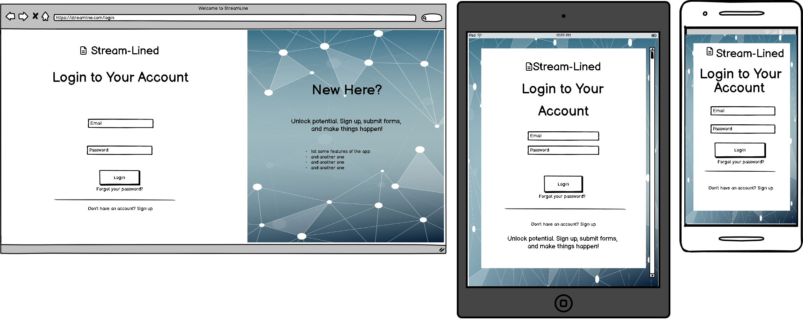

#### Account Creation

#### Home

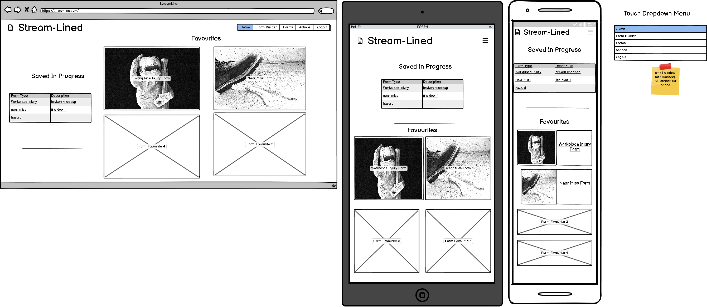

#### Form Builder

#### Form Builder - Preview Form

#### Forms

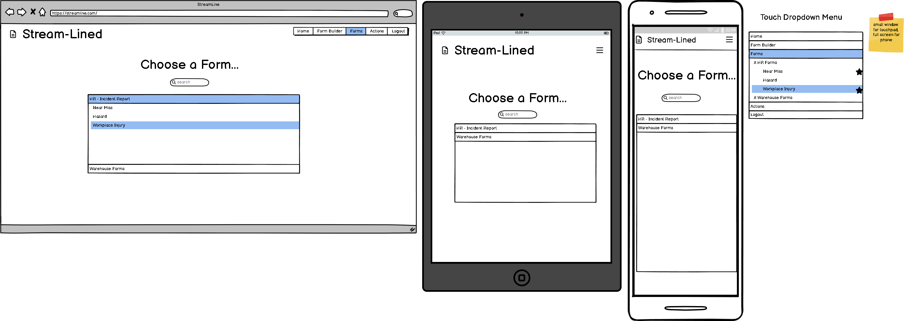

#### Forms - Form selected

#### Forms - Fill out form

#### Actions - Assignee

#### Actions - Assigner

#### Actions - Empty

#### Closed Form

## R6	Screenshots of your Trello board throughout the duration of the project	

25th - Jan
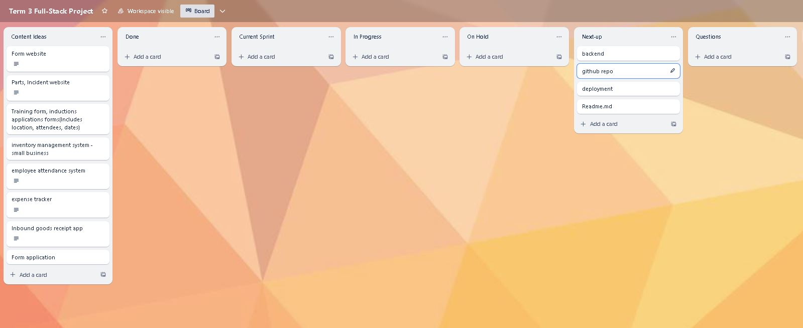
27th - Jan
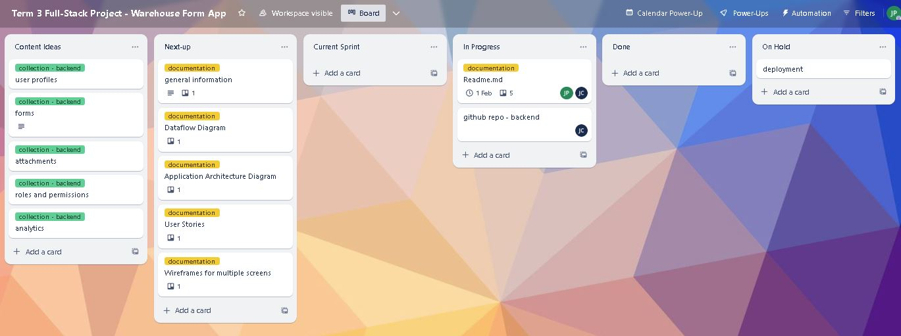
28th - Jan
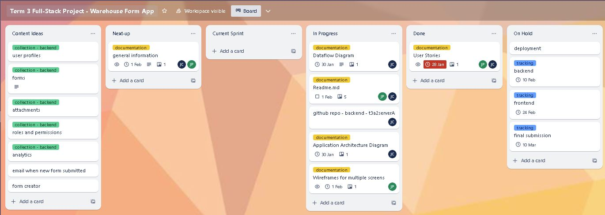
29th - Jan
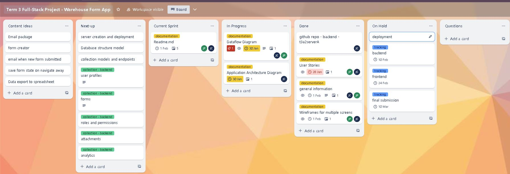
30th - Jan
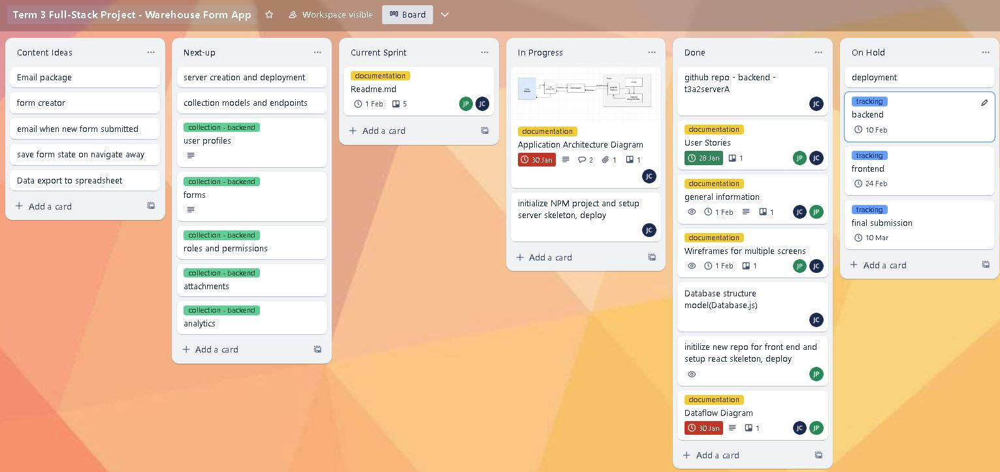
01st - Feb
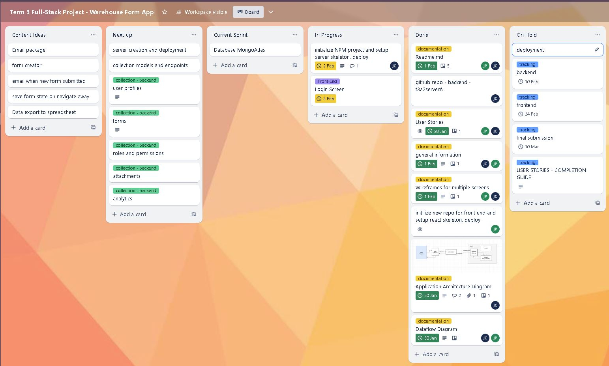
03rd - Feb
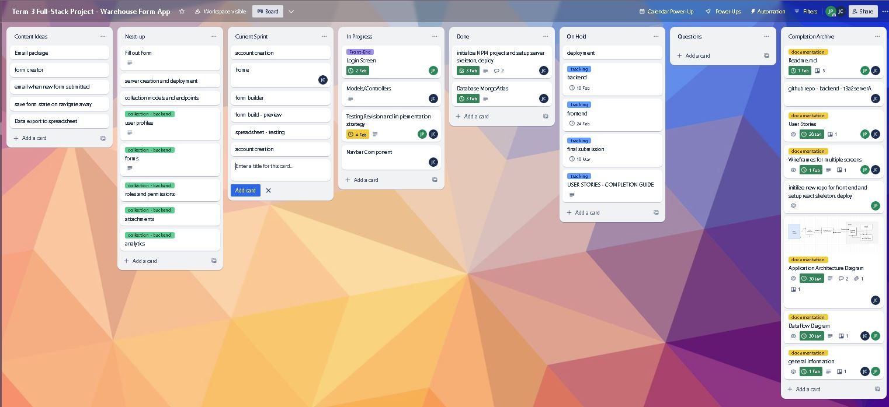
04th - Feb
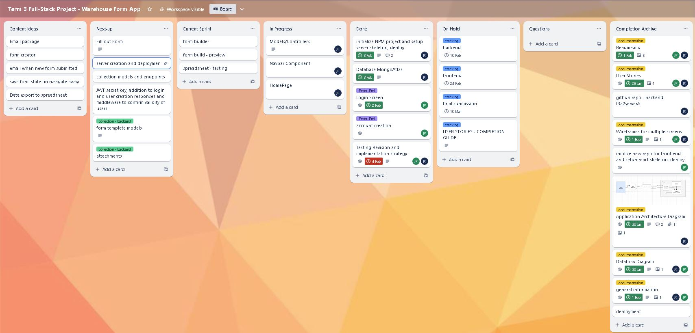
05th - Feb
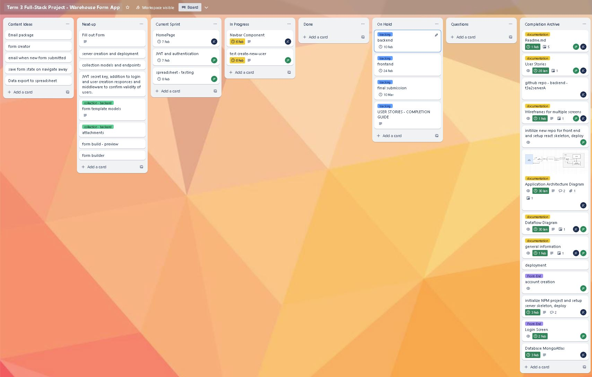
09th - Feb
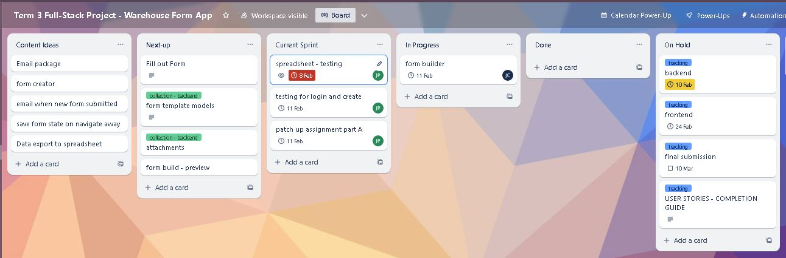
12th - Feb
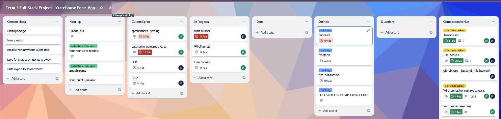
